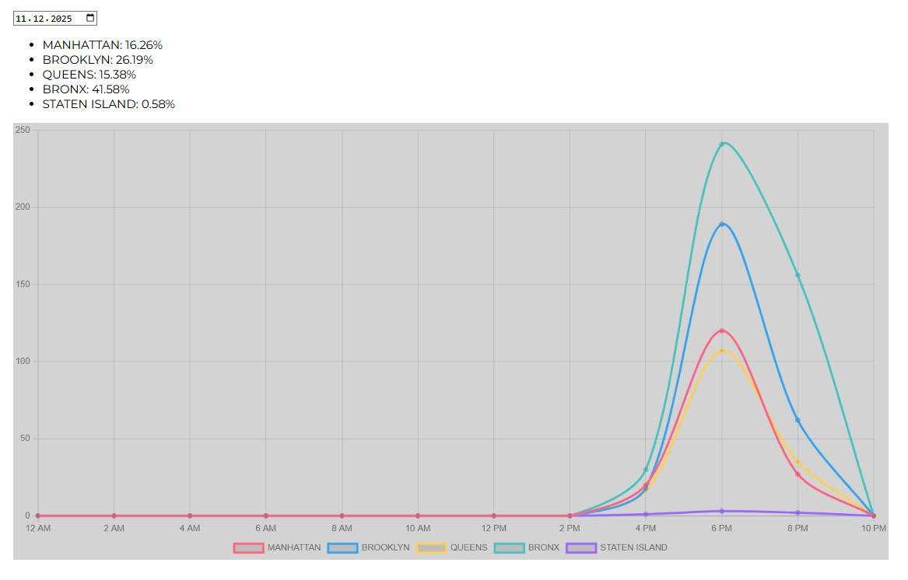

DOKUMENATION

    KURZBESCHREIBUNG
        New York City ist eine riesige Stadt mit rund 8,4 Mio. Einwohner:innen – eine Stadt, in der bestimmt nicht immer alles rund läuft. Unser Projekt zeigt auf, in welchen der fünf Stadtteile (Brooklyn, Queens, Staten Island, Bronx und Manhattan) die meisten Beschwerden eingehen.
        Unsere API liefert dazu verschiedene Informationen, wie die Kategorie der Beschwerde (z.B. „Noise“) sowie eine genauere Beschreibung wie „Loud Music/Party“. Mithilfe eines Datepickers kann ein beliebiges Datum in der Vergangenheit ausgewählt werden. Daraufhin zeigt eine New-York-City-Karte an, in welchem Viertel an diesem Tag die meisten Beschwerden eingegangen sind. Zusätzlich stellt ein Podest die Top drei Beschwerden dar und macht sichtbar, worüber sich die Bewohner:innen am häufigsten beschweren.

        Mit etwas Fantasie könnte unser Projekt beispielsweise für Behörden in New York City spannend sein, um gezielt zu erkennen, in welchen Stadtteilen Handlungsbedarf besteht.
               

    LEARNINGS
        Aus dem Projekt haben wir gelernt, dass es wichtiger ist, Daten aussagekräftig zu präsentieren, als möglichst viele Daten darzustellen. Auch wenn das bedeutet, gewisse Informationen wegzulassen, kann dies sinnvoller sein, als irrelevante Daten beizubehalten, die keine klare Aussage liefern. 

    SCHWIERIGKEITEN
        Beim Projekt-Pitch haben wir unsere API gemeinsam mit Lea besprochen, da wir anfangs einige Probleme hatten. Es war zunächst unklar, ob die API überhaupt noch aktualisiert wird. Deshalb haben wir die API über eine Woche hinweg beobachtet und parallel nach alternativen APIs gesucht. Nach dieser Woche kamen wir zum Schluss, dass die API tatsächlich aktualisiert wird. Daraufhin haben wir unser Projekt konkret umgesetzt.
        In einer späteren Unterrichtseinheit haben wir ein Liniendiagramm mit dem Datepicker eingebaut, das anzeigen sollte, zu welchen Uhrzeiten die Beschwerden eingegangen sind. Das Diagramm sah jedoch unabhängig vom gewählten Datum nahezu identisch aus. Die Linien aller Viertel lagen meist bei null, ausser zwischen zwei und vier Uhr nachts, was aussagen sollte, dass nur dann Beschwerden eingegangen sind, was keinen Sinn ergab. Somit war das Diagramm für unser Projekt wenig aussagekräftig.
        Gemeinsam mit Lea haben wir überprüft, ob dies an unserer Datenbank lag, stellten jedoch fest, dass die Ursache bei der API selbst lag. Da diese nur einmal täglich aktualisiert wird, hatten alle Beschwerden praktisch denselben Zeitstempel. Die Zeitstempel in der API waren somit nicht sinnvoll nutzbar. Lea empfahl uns, das Diagramm weiter zu beobachten und es gegebenenfalls zu entfernen. Nach zwei weiteren Wochen ohne Veränderung haben wir uns entschieden, das Diagramm vollständig aus dem Projekt zu streichen. Lieber lassen wir es weg, als etwas zu zeigen, das keine Aussagekraft hat.

        Eine weitere Schwierigkeit bestand darin, die Map so zu gestalten, wie wir sie uns vorgestellt haben. Das Ziel war, dass beim Hovern über die einzelnen Stadteile dieser Teil der Karte etwas grösser wird, um die Userexperience angenehmer und etwas dynamischer zu machen. Also haben wir die einzelnen Viertel der Karte als einzelne SVG's hochgeladen. Allerdings ist es uns nicht gelungen die zum Teil entstandenen Lücken zwischen den einzelnen Kartenteilen zu entfernen. Wir haben uns daher überlegt, die Karte als ein SVG hochzuladen, wodurch aber der Hovereffekt über die einzelnen Viertel fehlen würde und somit unserer Meinung nach auch die Userexperience nicht mehr dieselbe wäre. Also sind wir den Kompromiss eingegangen, dass es zwar eine Lücke zwischen einigen Kartenteilen hat, dafür aber ein wichtiger Hovereffekt beibehalten werden kann.

        Zwischen dem 17.12.–20.12. und dem 23.12.–29.12. ist uns eine Aufzeichnungslücke im Datepicker aufgefallen. Unsere Datenbank funktionierte in diesem Zeitraum einwandfrei. Bei der Überprüfung der API stellten wir jedoch fest, dass für diese Tage keine Daten bereitgestellt wurden. Am 03.01.26 waren die fehlenden Daten in der API plötzlich verfügbar. Wir gehen daher davon aus, dass die API in diesem Zeitraum nicht täglich aktualisiert wurde und die Daten erst nachträglich geladen wurden, weshalb unsere Datenbank diese nicht erfassen konnte.

    BENUTZTE RESSOURCEN
        Den grössten Teil des Projekts konnten wir im Unterricht umsetzen, was eine grosse Hilfe war. Dadurch konnten wir gemeinsam arbeiten, uns austauschen und direkt Live-Coaching in Anspruch nehmen. Zusätzlich haben wir viel mit AI bzw. ChatGPT gearbeitet. Dabei war es wichtig, sehr klare und präzise Prompts zu formulieren. So haben wir häufig bereits gut funktionierenden Code erhalten, den wir nur noch leicht anpassen mussten. Zusätzlich haben wir ChatGPT genutzt, um Fehler im Code auszuamchen, wenn etwas nicht funktioniert hat und wir den Fehler selbst nicht gefunden haben. 

